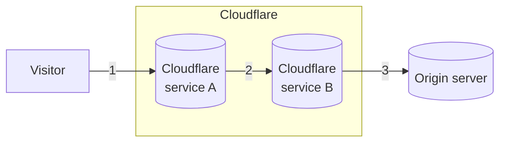

For years, Cloudflare has been researching and [writing about post quantum](https://blog.cloudflare.com/tag/post-quantum/).

To protect you against the risk of [store now, decrypt later](https://en.wikipedia.org/wiki/Harvest_now,_decrypt_later), and considering all the [connections](#three-connections-in-the-life-of-a-request) that take place when your website or application is on Cloudflare, we have deployed and are actively expanding the use of post-quantum hybrid key agreement.

:::caution[TLS 1.3]
Post-quantum key agreements are only supported in protocols based on TLS 1.3 (including HTTP/3) and are disabled for websites in [FIPS mode](/cloudflare-one/policies/gateway/http-policies/tls-decryption/#fips-compliance).
:::

## Three building blocks of TLS

Before TLS can protect your communications, three cryptographic algorithms have to be agreed on during the [TLS handshake](https://www.cloudflare.com/learning/ssl/what-happens-in-a-tls-handshake/):

- **Symmetric ciphers:** Algorithms used to encrypt and decrypt data, ensuring confidentiality and integrity (such as `CHACHA20-POLY1305`).
- **Key agreement:** A cryptographic protocol that allows client and server to safely agree on a shared key (such as `ECDH`).
- **Signature algorithms:** Cryptographic algorithms used to generate the digital signatures in TLS certificates (such as `RSA` and `ECDSA`).

As explained in our [blog post](https://blog.cloudflare.com/pq-2024/#two-migrations), the first, most urgent migration has to do with key agreement.

### Hybrid key agreement

With TLS 1.3, [X25519](https://en.wikipedia.org/wiki/Curve25519) - an Elliptic Curve Diffie-Hellman (ECDH) protocol - is the current standard used in key agreement. However, its security can be easily broken by quantum computers using [Shor's algorithm](https://en.wikipedia.org/wiki/Shor%27s_algorithm).

In response to this, Cloudflare is an early adopter of ML-KEM, the post-quantum key agreement selected by the US National Institute of Standards and Technology (NIST). For a detailed timeline and more background information refer to [The state of the post-quantum Internet](https://blog.cloudflare.com/pq-2024/).

Cloudflare has deployed the following hybrid key agreements:

- [X25519MLKEM768](https://datatracker.ietf.org/doc/draft-kwiatkowski-tls-ecdhe-mlkem/) (Recommended)
    - TLS identifier: `0x11ec`
- [X25519Kyber768Draft00](https://datatracker.ietf.org/doc/draft-tls-westerbaan-xyber768d00/) (Obsolete)
    - TLS identifier: `0x6399`

A hybrid key agreement lays the groundwork as more and more [clients](#visitor-to-cloudflare) adopt post-quantum cryptography, while also maintaining the current security provided by X25519. It is a safer path in case of an unexpected breakthrough that renders all variants of ML-KEM insecure.

## Three connections in the life of a request

### 1. Visitor to Cloudflare

As of [october 2023](https://blog.cloudflare.com/post-quantum-for-all/), all websites and APIs served through Cloudflare over TLS 1.3 support post-quantum hybrid key agreement. However, the connection is only post-quantum secured if the client also supports post-quantum cryptography.

Refer to [Post-quantum cryptography support](/ssl/post-quantum-cryptography/pqc-support/) for a list of browsers and other clients that are compatible with hybrid key agreements.

### 2. Internal connections

### 3. Cloudflare to your origin